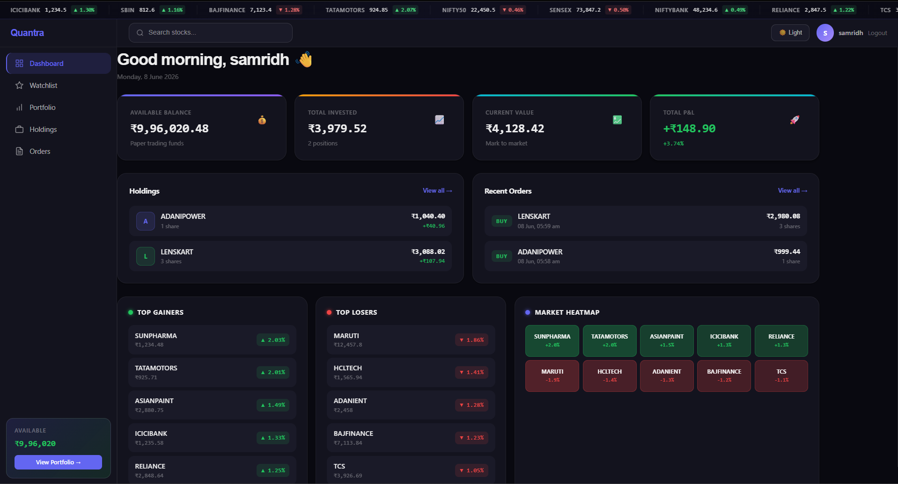
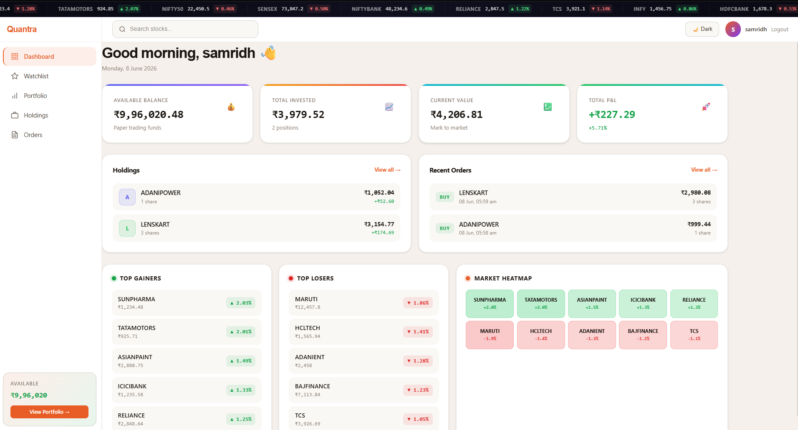
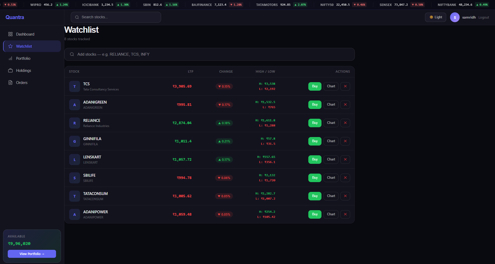
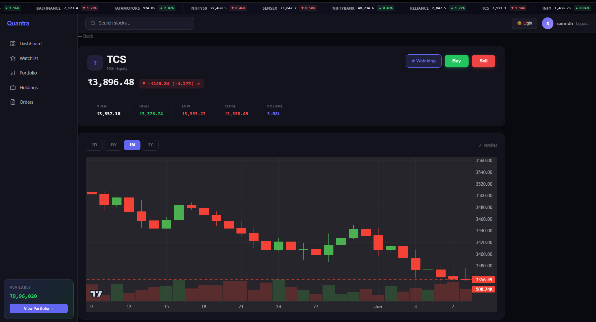
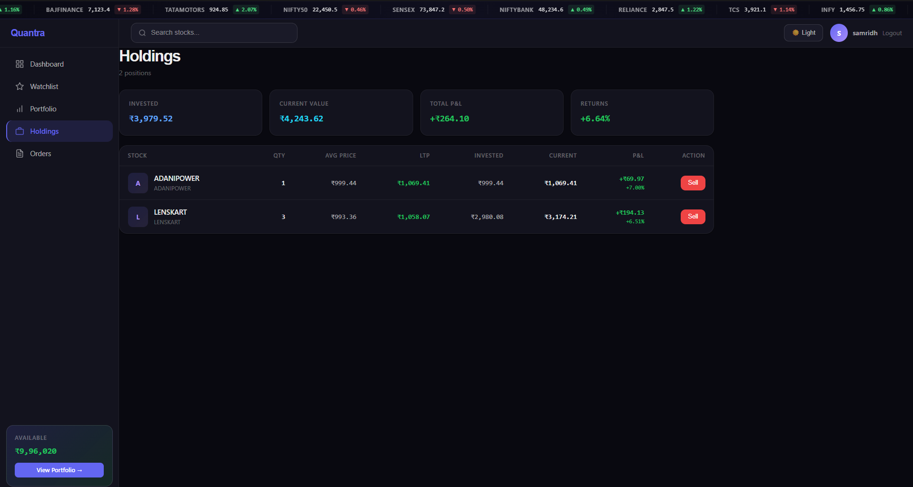
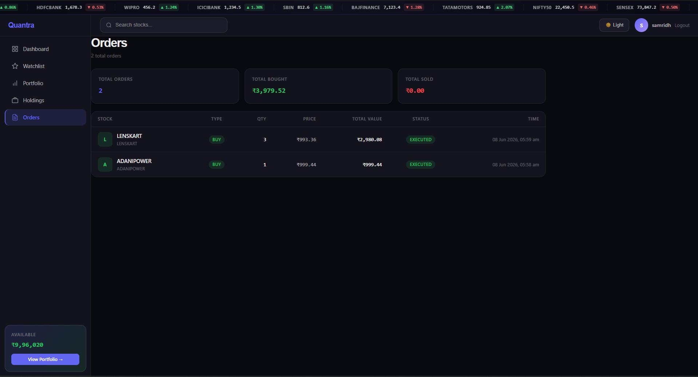

# Quantra — Paper Trading Platform

> A full-stack, real-time paper trading platform inspired by Kite by Zerodha. Built with React, Node.js, PostgreSQL, and WebSockets.

<!-- SCREENSHOT: Take a full-page screenshot of your dashboard in dark mode and replace the line below -->


---

## 🔗 Links

| | |
|---|---|
| **Live Demo** | [quantra-gamma.vercel.app](https://quantra-gamma.vercel.app) |
| **Backend API** | [quantra-backend.onrender.com/api/health](https://quantra-backend.onrender.com/api/health) |

---

## 📖 Table of Contents

- [Overview](#overview)
- [Features](#features)
- [Tech Stack](#tech-stack)
- [Screenshots](#screenshots)
- [Architecture](#architecture)
- [Getting Started](#getting-started)
- [Environment Variables](#environment-variables)
- [API Reference](#api-reference)
- [Deployment](#deployment)
- [Roadmap](#roadmap)

---

## Overview

Quantra is a full-stack paper trading platform that lets users practice stock trading with virtual money — no real funds involved. It mimics the core experience of professional trading platforms like Kite by Zerodha, with real-time NSE stock prices, a complete order engine, live P&L tracking, and a modern dual-theme UI.

Users start with a virtual balance of ₹10,00,000 and can buy/sell NSE-listed stocks, track their portfolio performance, view candlestick charts, and monitor live market movements — all without risking real money.

Built as a portfolio project to demonstrate full-stack engineering skills including real-time systems, REST API design, JWT authentication, database management, and production deployment.

---

## ✨ Features

### Trading
- **Paper Trading** — Virtual ₹10,00,000 starting balance, no real money involved
- **Buy & Sell Orders** — Market orders with instant execution
- **Order Engine** — Validates balance, updates holdings, calculates average buy price
- **P&L Tracking** — Real-time profit and loss calculation per holding and overall portfolio

### Market Data
- **Live NSE Prices** — Real Indian stock prices via `stock-nse-india` library
- **WebSocket Updates** — Prices pushed to all connected clients every 3 seconds via Socket.IO
- **Price Flash Animation** — Rows flash green/red when prices change
- **Candlestick Charts** — OHLC charts with 4 timeframes (1D, 1W, 1M, 1Y) via TradingView's `lightweight-charts`
- **Top Gainers & Losers** — Live Nifty 50 movers panel
- **Market Heatmap** — Color-coded Nifty 50 stocks by % change
- **Market Ticker Bar** — Scrolling real-time ticker with Nifty 50, Sensex, Bank Nifty

### Pages
- **Dashboard** — Portfolio summary, holdings snapshot, recent orders, gainers/losers, heatmap
- **Watchlist** — Add/remove stocks, live prices with H/L, buy directly from watchlist
- **Holdings** — Full holdings table with avg price, LTP, invested value, current value, P&L
- **Orders** — Complete order history with timestamps and status
- **Portfolio** — Net worth overview, cash vs equity split, allocation bars per holding
- **Chart** — Candlestick chart per stock with OHLC stats, Buy/Sell buttons, watchlist toggle

### Auth & UX
- **JWT Authentication** — Secure register/login with bcrypt password hashing
- **Protected Routes** — All trading pages require authentication
- **Dark & Light Mode** — Full dual-theme support with persisted preference
- **Responsive Design** — Works on desktop and tablet

---

## 🛠 Tech Stack

### Frontend
| Technology | Purpose |
|---|---|
| React 18 (Vite) | UI framework |
| React Router DOM | Client-side routing |
| Tailwind CSS v4 | Styling |
| Zustand | Global state (auth, theme, live prices) |
| TanStack Query (React Query) | Server state, caching, refetching |
| Socket.IO Client | Real-time WebSocket connection |
| lightweight-charts | Candlestick/OHLC charts (by TradingView) |
| Axios | HTTP client with JWT interceptor |

### Backend
| Technology | Purpose |
|---|---|
| Node.js + Express.js | REST API server |
| Socket.IO | WebSocket server for live price broadcasting |
| Supabase (PostgreSQL) | Database — users, orders, holdings, watchlist |
| bcryptjs | Password hashing |
| jsonwebtoken | JWT generation and verification |
| node-cache | In-memory caching for prices and OHLC data |
| stock-nse-india | NSE India market data (no API key required) |

### Infrastructure
| Service | Purpose |
|---|---|
| Vercel | Frontend deployment (global CDN) |
| Render | Backend deployment (persistent Node.js process) |
| Supabase | Hosted PostgreSQL database (free tier) |
| GitHub | Version control and CI/CD trigger |

---

## 📸 Screenshots

### Dashboard — Dark Mode
<!-- SCREENSHOT: Full page dashboard in dark mode -->


### Dashboard — Light Mode
<!-- SCREENSHOT: Full page dashboard in light mode (toggle to light first) -->


### Watchlist — Live Prices
<!-- SCREENSHOT: Watchlist page with prices showing -->


### Chart Page — Candlestick Chart
<!-- SCREENSHOT: Chart page for any stock, showing the candlestick chart -->


### Holdings — P&L Breakdown
<!-- SCREENSHOT: Holdings page with some stocks bought -->


### Orders — Trade History
<!-- SCREENSHOT: Orders page showing order history -->



---

## 🏗 Architecture

```
quantra/
├── frontend/                   # React app (deployed on Vercel)
│   └── src/
│       ├── pages/              # Route-level components
│       │   ├── Dashboard.jsx
│       │   ├── Watchlist.jsx
│       │   ├── Chart.jsx
│       │   ├── Holdings.jsx
│       │   ├── Orders.jsx
│       │   ├── Portfolio.jsx
│       │   ├── Login.jsx
│       │   └── Register.jsx
│       ├── components/
│       │   ├── layout/         # AppShell, Sidebar, Navbar
│       │   ├── charts/         # CandlestickChart (lightweight-charts)
│       │   ├── market/         # MarketTicker (scrolling price bar)
│       │   ├── orders/         # OrderModal (buy/sell slide-in)
│       │   └── watchlist/      # StockTicker (price flash)
│       ├── hooks/
│       │   ├── useSocket.js    # Socket.IO connection + Zustand price store
│       │   ├── useMarketData.js # React Query wrappers for market API
│       │   └── usePortfolio.js  # React Query wrappers for portfolio API
│       ├── store/
│       │   ├── useAuthStore.js  # Zustand — JWT token + user
│       │   └── useThemeStore.js # Zustand — dark/light preference
│       └── api/
│           └── axiosInstance.js # Base URL + JWT interceptor
│
└── backend/                    # Express app (deployed on Render)
    ├── routes/
    │   ├── auth.js             # POST /register, POST /login
    │   ├── market.js           # GET /quotes, /ohlc, /indices, /movers, /search
    │   ├── orders.js           # POST /place
    │   └── portfolio.js        # GET /holdings, /orders, /watchlist, /profile
    ├── middleware/
    │   └── authMiddleware.js   # JWT verification
    ├── db/
    │   └── supabase.js         # Supabase client
    ├── utils/
    │   └── upstoxClient.js     # Upstox sandbox helper
    └── server.js               # Express + Socket.IO + price broadcast loop
```

### Data Flow

```
NSE India API
      │
      ▼
Backend (Express)
  ├── REST routes → React Query (15s cache) → UI components
  └── Socket.IO → broadcasts prices every 3s → Zustand store → live UI
```

### Database Schema (Supabase / PostgreSQL)

```sql
users      — id, name, email, password_hash, balance, created_at
watchlist  — id, user_id, symbol, company_name, added_at
holdings   — id, user_id, symbol, company_name, quantity, avg_price
orders     — id, user_id, symbol, order_type, quantity, price, status, created_at
```

---

## 🚀 Getting Started

### Prerequisites

- Node.js v18+
- A [Supabase](https://supabase.com) account (free)
- Git

### 1. Clone the repository

```bash
git clone https://github.com/AnshumanTri/Quantra.git
cd Quantra
```

### 2. Set up the database

Go to your Supabase project → SQL Editor → run this:

```sql
CREATE TABLE users (
  id UUID DEFAULT gen_random_uuid() PRIMARY KEY,
  name VARCHAR(100) NOT NULL,
  email VARCHAR(150) UNIQUE NOT NULL,
  password_hash TEXT NOT NULL,
  balance DECIMAL(15,2) DEFAULT 1000000.00,
  created_at TIMESTAMP DEFAULT NOW()
);

CREATE TABLE watchlist (
  id UUID DEFAULT gen_random_uuid() PRIMARY KEY,
  user_id UUID REFERENCES users(id) ON DELETE CASCADE,
  symbol VARCHAR(20) NOT NULL,
  company_name VARCHAR(100),
  added_at TIMESTAMP DEFAULT NOW(),
  UNIQUE(user_id, symbol)
);

CREATE TABLE holdings (
  id UUID DEFAULT gen_random_uuid() PRIMARY KEY,
  user_id UUID REFERENCES users(id) ON DELETE CASCADE,
  symbol VARCHAR(20) NOT NULL,
  company_name VARCHAR(100),
  quantity INTEGER NOT NULL DEFAULT 0,
  avg_price DECIMAL(10,2) NOT NULL,
  UNIQUE(user_id, symbol)
);

CREATE TABLE orders (
  id UUID DEFAULT gen_random_uuid() PRIMARY KEY,
  user_id UUID REFERENCES users(id) ON DELETE CASCADE,
  symbol VARCHAR(20) NOT NULL,
  company_name VARCHAR(100),
  order_type VARCHAR(10) CHECK (order_type IN ('BUY', 'SELL')),
  quantity INTEGER NOT NULL,
  price DECIMAL(10,2) NOT NULL,
  status VARCHAR(20) DEFAULT 'EXECUTED',
  created_at TIMESTAMP DEFAULT NOW()
);
```

### 3. Set up the backend

```bash
cd backend
npm install
```

Create `backend/.env`:

```env
PORT=5000
NODE_ENV=development
JWT_SECRET=your_jwt_secret_here
SUPABASE_URL=your_supabase_project_url
SUPABASE_ANON_KEY=your_supabase_anon_key
UPSTOX_API_KEY=your_upstox_key
UPSTOX_API_SECRET=your_upstox_secret
UPSTOX_REDIRECT_URI=http://localhost:5173
```

Start the backend:

```bash
npm run dev
```

Backend runs at `http://localhost:5000`

### 4. Set up the frontend

```bash
cd frontend
npm install
```

Create `frontend/.env`:

```env
VITE_API_URL=http://localhost:5000/api
VITE_SOCKET_URL=http://localhost:5000
```

Start the frontend:

```bash
npm run dev
```

Frontend runs at `http://localhost:5173`

### 5. Open the app

Visit `http://localhost:5173` → Register an account → start trading.

---

## 🔐 Environment Variables

### Backend (`backend/.env`)

| Variable | Description |
|---|---|
| `PORT` | Server port (default: 5000) |
| `NODE_ENV` | `development` or `production` |
| `JWT_SECRET` | Secret key for signing JWT tokens |
| `SUPABASE_URL` | Your Supabase project URL |
| `SUPABASE_ANON_KEY` | Your Supabase anon/public key |
| `UPSTOX_API_KEY` | Upstox sandbox API key (optional) |
| `UPSTOX_API_SECRET` | Upstox sandbox API secret (optional) |
| `UPSTOX_REDIRECT_URI` | Upstox OAuth redirect URI |

### Frontend (`frontend/.env`)

| Variable | Description |
|---|---|
| `VITE_API_URL` | Backend REST API base URL |
| `VITE_SOCKET_URL` | Backend WebSocket URL |

---

## 📡 API Reference

### Auth

| Method | Endpoint | Description |
|---|---|---|
| POST | `/api/auth/register` | Register new user, returns JWT |
| POST | `/api/auth/login` | Login, returns JWT |

### Portfolio (Protected — requires JWT)

| Method | Endpoint | Description |
|---|---|---|
| GET | `/api/portfolio/profile` | Get user profile + balance |
| GET | `/api/portfolio/holdings` | Get all holdings |
| GET | `/api/portfolio/orders` | Get all orders |
| GET | `/api/portfolio/watchlist` | Get watchlist |
| POST | `/api/portfolio/watchlist` | Add stock to watchlist |
| DELETE | `/api/portfolio/watchlist/:symbol` | Remove from watchlist |

### Orders (Protected)

| Method | Endpoint | Description |
|---|---|---|
| POST | `/api/orders/place` | Place a buy or sell order |

### Market (Protected)

| Method | Endpoint | Description |
|---|---|---|
| GET | `/api/market/quotes?symbols=TCS,INFY` | Get live quotes |
| GET | `/api/market/ohlc/:symbol?interval=1M` | Get OHLC candle data |
| GET | `/api/market/indices` | Get Nifty 50, Sensex, Bank Nifty |
| GET | `/api/market/movers` | Get top gainers and losers |
| GET | `/api/market/search?q=REL` | Search stocks |

---

## 📦 Deployment

### Frontend → Vercel

1. Push code to GitHub
2. Import repo on [vercel.com](https://vercel.com)
3. Set Root Directory to `frontend`
4. Add environment variables: `VITE_API_URL`, `VITE_SOCKET_URL`
5. Deploy

### Backend → Render

1. Import repo on [render.com](https://render.com)
2. Set Root Directory to `backend`
3. Set Start Command to `node server.js`
4. Add all backend environment variables
5. Deploy

> **Note:** Vercel is serverless and cannot run Socket.IO. The backend must be on a persistent server like Render for WebSocket support.

---

## 🗺 Roadmap

- [ ] Upstox live API integration (replace sandbox)
- [ ] Limit orders (pending order state)
- [ ] Portfolio historical P&L chart (line graph over time)
- [ ] Stock news feed per symbol
- [ ] Nifty 50 full heatmap
- [ ] Mobile responsive layout improvements
- [ ] Multi-watchlist support
- [ ] Export trade history to CSV

---

## 👨‍💻 Author

**Anshuman Trivedi**
B.Tech Mechanical Engineering — NIT Rourkela

---

## 📄 License

This project is open source and available under the [MIT License](LICENSE).

---

> Built with ❤️ as a portfolio project to demonstrate full-stack engineering with real-time systems, REST API design, and modern React development.
